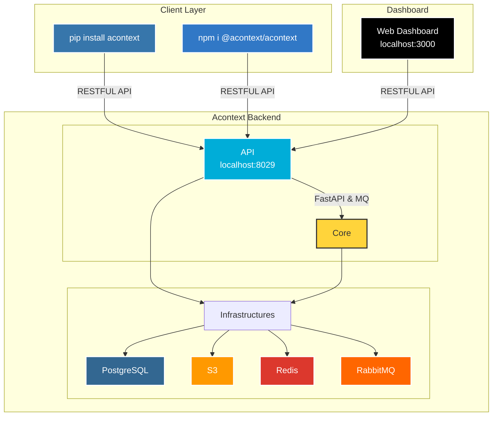

<div align="center">
  <a href="https://discord.acontext.io">
      
  </a>
 	<p align="center">
 	  	<a href="https://acontext.io">🌐 Website</a>
      |
 	  	<a href="https://docs.acontext.app">📚 Document</a>
  </p>
  <p align="center">
    <a href="https://pypi.org/project/acontext/"></a>
    <a href="https://www.npmjs.com/package/@acontext/acontext"></a>
    <a href="https://github.com/memodb-io/acontext/actions/workflows/core-test.yaml"></a>
    <a href="https://github.com/memodb-io/acontext/actions/workflows/api-test.yaml"></a>
    <a href="https://github.com/memodb-io/acontext/actions/workflows/cli-test.yaml"></a>
  </p>
<p align="center">
 	  	<a href="https://x.com/acontext_io"></a>
    <a href="https://discord.acontext.io"></a>
  </p>
</div>


Acontext is a context data platform for production AI agents. Think of it as Supabase for agent context — with skill-based memory your agents build and humans can actually read.

Unifies context storage, observability, and skill memory for production AI agents — filesystem-compatible, configurable, and human-readable.


# ❓ Why use Acontext

#### The Problem

- **Your agent's memory is a black box** — vector stores and key-value memory are opaque, not inspectable, and not version controllable
- **Context data is scattered** — messages, files, and skills live in different storages with no unified interface
- **No observability on agent state** — you can't track success rates, replay trajectories, or know if your agent is actually working

#### Acontext's Approach

- **Memory stored as skills** — plain markdown files your team can read, edit, version control, and mount in sandboxes
- **Configurable schemas** — each SKILL.md defines how memory is organized, not the platform
- **Automatic learning** — agents distill successful task outcomes into reusable skill files, improving with every run
- **Unified context storage** for messages, files, and skills — integrated with Claude Agent SDK, AI-SDK, OpenAI SDK...
- **Built-in observability** — replay trajectories, track success rates, and monitor agents in real-time

<div align="center">
        
</div>


# 💡 Core Features

- **Skill Memory** — [What is Skill Memory?](https://docs.acontext.app/learn/skill-memory)
  - [Agent Skills](https://docs.acontext.app/store/skill) - filesystem-compatible, configurable, human-readable skill files
  - [Skill Memory Quickstart](https://docs.acontext.app/learn/quick) - agents automatically build and update skills from successful sessions
- **Context Storage**
  - [Session](https://docs.acontext.app/store/messages/multi-provider): save agent history from any LLM, any modality
    - [Context Editing](https://docs.acontext.app/engineering/editing) - edit context window in one API
  - [Disk](https://docs.acontext.app/store/disk): virtual, persistent filesystem
  - [Sandbox](https://docs.acontext.app/store/sandbox) - run code, analyze data, export artifacts
- **Observability**
  - [Session Summary](https://docs.acontext.app/observe/agent_tasks): asynchronously summarize agent progress and user feedback
  - [State Tracking](https://docs.acontext.app/observe/agent_tasks): collect agent status in near real-time
  - View everything in one [dashboard](https://docs.acontext.app/observe/dashboard)

<div align="center">
    <picture>
      
    </picture>
  <p>Dashboard of Agent Success Rate and Other Metrics</p>
</div>


# 🚀 Step-by-step Quickstart

### Connect to Acontext

1. Go to [Acontext.io](https://acontext.io), claim your free credits.
2. Go through a one-click onboarding to get your API Key (starts with `sk-ac`)

<div align="center">
    <picture>
      
    </picture>
</div>


<details>
<summary>💻 Self-host Acontext</summary>

We have an `acontext-cli` to help you do quick proof-of-concept. Download it first in your terminal:

```bash
curl -fsSL https://install.acontext.io | sh
```

You should have [docker](https://www.docker.com/get-started/) installed and an OpenAI API Key to start an Acontext backend on your computer:

```bash
mkdir acontext_server && cd acontext_server
acontext server up
```

> Make sure your LLM has the ability to [call tools](https://platform.openai.com/docs/guides/function-calling). By default, Acontext will use `gpt-4.1`.

`acontext server up` will create/use  `.env` and `config.yaml` for Acontext, and create a `db` folder to persist data.


Once it's done, you can access the following endpoints:

- Acontext API Base URL: http://localhost:8029/api/v1
- Acontext Dashboard: http://localhost:3000/

</details>


### Install SDKs

We're maintaining Python [](https://pypi.org/project/acontext/) and Typescript [](https://www.npmjs.com/package/@acontext/acontext) SDKs. The snippets below are using Python.

> Click the doc link to see TS SDK Quickstart.

```bash
pip install acontext
```


### Initialize Client

```python
import os
from acontext import AcontextClient

# For cloud:
client = AcontextClient(
    api_key=os.getenv("ACONTEXT_API_KEY"),
)

# For self-hosted:
client = AcontextClient(
    base_url="http://localhost:8029/api/v1",
    api_key="sk-ac-your-root-api-bearer-token",
)
```


### Skill Memory in 3 Steps

> [Docs](https://docs.acontext.app/learn/skill-memory)

Create a learning space, store agent sessions, and let Acontext automatically build skill memory.

```python
# 1. Create a learning space
space = client.learning_spaces.create()

# 2. Attach sessions
session = client.sessions.create()
client.learning_spaces.learn(space.id, session_id=session.id)

# 3. Learn from the session — Acontext distills it into skill files
client.sessions.store_message(
    session_id=session.id,
    blob={"role": "user", "content": "My name is Gus"},
)
# ... your agent runs, storing messages along the way ...
# ... agent completes the task ...


# View the learned skills (plain markdown files you can read, edit, version control)
skills = client.learning_spaces.list_skills(space.id)
for skill in skills:
    print(f"\n=== {skill.name} ===")
    print(f"Description: {skill.description}")
    print(f"Files:")
    for f in skill.file_index:
        print(f"  {f.path}")
        content = client.skills.get_file(skill_id=skill.id, file_path=f.path)
        print(content.content.raw)
```

### More Features

Acontext also provides unified context storage, observability, and agent tools:

- **[Multi-provider Messages](https://docs.acontext.app/store/messages/multi-provider)** — Store in OpenAI/Anthropic/Gemini format, auto-convert on retrieval
- **[Context Engineering](https://docs.acontext.app/engineering/editing)** — Compress context with summaries and edit strategies
- **[Disk](https://docs.acontext.app/store/disk)** — Virtual, persistent filesystem for agents
- **[Sandbox](https://docs.acontext.app/store/sandbox)** — Isolated code execution with bash, Python, and [mountable skills](https://docs.acontext.app/tool/bash_tools#mounting-skills-in-sandbox)
- **[Observability](https://docs.acontext.app/observe/dashboard)** — Track agent tasks, success rates, and replay trajectories
- **[Agent Tools](https://docs.acontext.app/tool/whatis)** — Disk tools, sandbox tools, and skill tools for LLM function calling


# 🧐 Use Acontext to build Agent

Download end-to-end scripts with `acontext`:

**Python**

```bash
acontext create my-proj --template-path "python/openai-basic"
```

More examples on Python:

- `python/openai-agent-basic`: openai agent sdk template
- `python/openai-agent-artifacts`: agent can edit and download artifacts
- `python/claude-agent-sdk`: claude agent sdk with `ClaudeAgentStorage`
- `python/agno-basic`: agno framework template
- `python/smolagents-basic`: smolagents (huggingface) template
- `python/interactive-agent-skill`: interactive sandbox with mountable agent skills

**Typescript**

```bash
acontext create my-proj --template-path "typescript/openai-basic"
```

More examples on Typescript:
- `typescript/vercel-ai-basic`: agent in @vercel/ai-sdk
- `typescript/claude-agent-sdk`: claude agent sdk with `ClaudeAgentStorage`
- `typescript/interactive-agent-skill`: interactive sandbox with mountable agent skills


> [!NOTE]
>
> Check our example repo for more templates: [Acontext-Examples](https://github.com/memodb-io/Acontext-Examples).
>
> We're cooking more full-stack Agent Applications! [Tell us what you want!](https://discord.acontext.io)


# 🔍 Document

To learn more about skill memory and what Acontext can do, visit [our docs](https://docs.acontext.app/) or start with [What is Skill Memory?](https://docs.acontext.app/learn/skill-memory)


# ❤️ Stay Updated

Star Acontext on Github to support and receive instant notifications 


# 🏗️ Architecture

<details>
<summary>click to open</summary>



</details>

# 🤝 Stay Together

Join the community for support and discussions:

-   [Discuss with Builders on Acontext Discord](https://discord.acontext.io) 👻 
-  [Follow Acontext on X](https://x.com/acontext_io) 𝕏 


# 🌟 Contributing

- Check our [roadmap.md](./ROADMAP.md) first.
- Read [contributing.md](./CONTRIBUTING.md)


# 🥇 Badges

 

```md
[](https://acontext.io)

[](https://acontext.io)
```


# 📑 LICENSE

This project is currently licensed under [Apache License 2.0](LICENSE).

