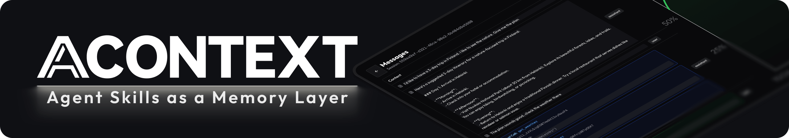
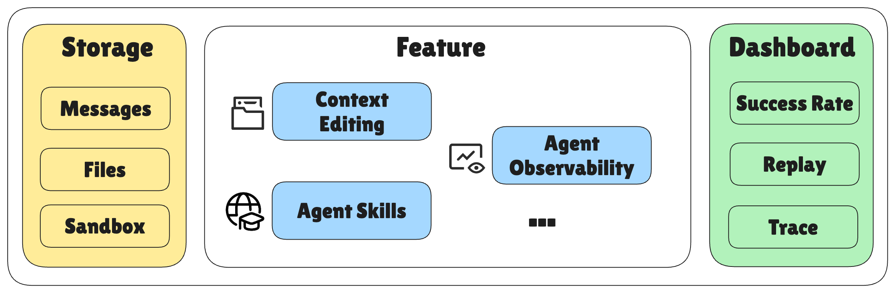
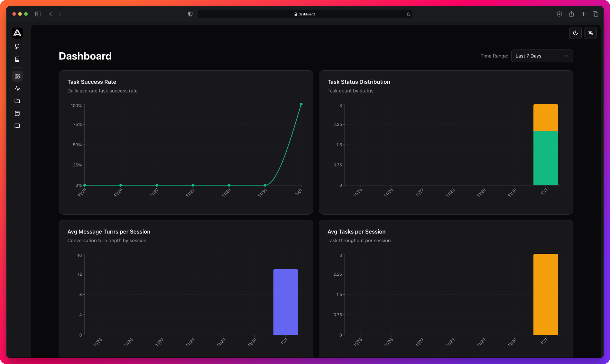
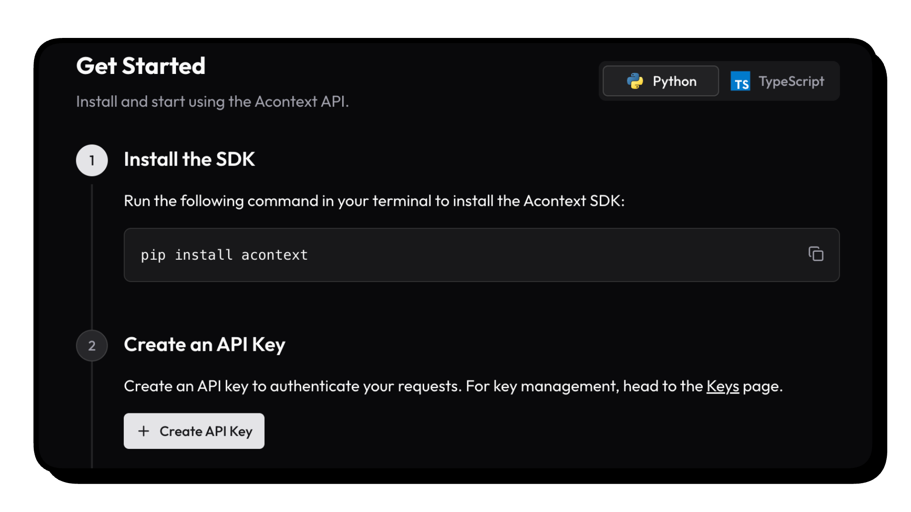
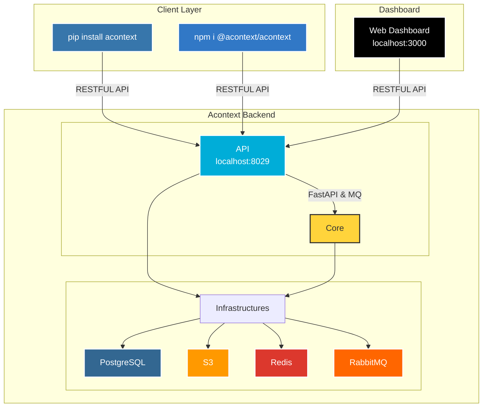

<div align="center">
  <a href="https://discord.acontext.io">
      
  </a>
 	<p align="center">
 	  	<a href="https://acontext.io">🌐 Website</a>
      |
 	  	<a href="https://docs.acontext.io">📚 Document</a>
  </p>
  <p align="center">
    <a href="https://pypi.org/project/acontext/"></a>
    <a href="https://www.npmjs.com/package/@acontext/acontext"></a>
    <a href="https://github.com/memodb-io/acontext/actions/workflows/core-test.yaml"></a>
    <a href="https://github.com/memodb-io/acontext/actions/workflows/api-test.yaml"></a>
    <a href="https://github.com/memodb-io/acontext/actions/workflows/cli-test.yaml"></a>
  </p>
<p align="center">
 	  	<a href="https://x.com/acontext_io"></a>
    <a href="https://discord.acontext.io"></a>
  </p>
</div>


Acontext is a context data platform for production AI agents. Think of it as Supabase, but purpose-built for agent context.

We help agents scale from local demos to production without rebuilding context infrastructure — giving you unified storage, built-in context engineering, and context observability out of the box.


# ❓ Why use Acontext

#### Challenges in Building Agents

- Context data like **llm messages, files, and skills are scattered** across different storages
- **Long-running agents need context management**, and you have to build it yourself
- **Tracking states from multi-modal, multi-llm Agents is a nightmare**, how you know your agent is great?

#### How Acontext Solves It

- **One unified storage** for messages, files, skills, and more. Integrated with Claude Agent SDK, AI-SDK, OpenAI SDK...
- **Built-in context management** methods — just one argument, zero code
- **Replay** agent trajectory in Dashboard
- **Observe** agent with background monitor to estimate success rate

<div align="center">
        
</div>


# 💡 Core Features

- **Context Storage**
  - [Session](https://docs.acontext.io/store/messages/multi-provider): save agent history from any llm, any modal.
    - [Context Editing](https://docs.acontext.io/engineering/editing) - edit context window in one api.
  - [Disk](https://docs.acontext.io/store/disk): virtual, persistent filesystem,
  - [Agent Skills](https://docs.acontext.io/store/skill) - manage skills in server-side.
  - [Sandbox](https://docs.acontext.io/store/sandbox) - run code, analyze data, export artifacts.


- **Context Observability**
  - [Session Summary](https://docs.acontext.io/observe/agent_tasks): asynchronously summarize agent's progress and user feedback.
  - [State Tracking](https://docs.acontext.io/observe/agent_tasks): collect agent's working status in near real-time.
- **View everything in one [dashboard](https://docs.acontext.io/observe/dashboard)**

<div align="center">
    <picture>
      
    </picture>
  <p>Dashboard of Agent Success Rate and Other Metrics</p>
</div>


# 🚀 Step-by-step Quickstart

### Connect to Acontext

1. Go to [Acontext.io](https://acontext.io), claim your free credits.
2. Go through a one-click onboarding to get your API Key (starts with `sk-ac`)

<div align="center">
    <picture>
      
    </picture>
</div>


<details>
<summary>💻 Self-host Acontext</summary>

We have an `acontext-cli` to help you do quick proof-of-concept. Download it first in your terminal:

```bash
curl -fsSL https://install.acontext.io | sh
```

You should have [docker](https://www.docker.com/get-started/) installed and an OpenAI API Key to start an Acontext backend on your computer:

```bash
mkdir acontext_server && cd acontext_server
acontext server up
```

> Make sure your LLM has the ability to [call tools](https://platform.openai.com/docs/guides/function-calling). By default, Acontext will use `gpt-4.1`.

`acontext server up` will create/use  `.env` and `config.yaml` for Acontext, and create a `db` folder to persist data.


Once it's done, you can access the following endpoints:

- Acontext API Base URL: http://localhost:8029/api/v1
- Acontext Dashboard: http://localhost:3000/

</details>


### Install SDKs

We're maintaining Python [](https://pypi.org/project/acontext/) and Typescript [](https://www.npmjs.com/package/@acontext/acontext) SDKs. The snippets below are using Python.

> Click the doc link to see TS SDK Quickstart.

```bash
pip install acontext
```


### Initialize Client

```python
import os
from acontext import AcontextClient

# For cloud:
client = AcontextClient(
    api_key=os.getenv("ACONTEXT_API_KEY"),
)

# For self-hosted:
client = AcontextClient(
    base_url="http://localhost:8029/api/v1",
    api_key="sk-ac-your-root-api-bearer-token",
)
```


### Store & Get Messages

> [Docs](https://docs.acontext.io/store/messages/multi-provider)

Store messages in OpenAI, Anthropic, or Gemini format. Auto-converts on retrieval.

```python
# Create session and store messages
session = client.sessions.create()

# Store text, image, file, etc.
client.sessions.store_message(
    session_id=session.id,
    blob={"role": "user", "content": "Hello!"},
    format="openai"
)

# Retrieve in any format (auto-converts)
result = client.sessions.get_messages(session_id=session.id, format="anthropic")
```

### Context Engineering

> [Session Summary](https://docs.acontext.io/engineering/session_summary) | [Context Editing](https://docs.acontext.io/engineering/editing)

Compress context with summaries and edit strategies. Original messages unchanged.

```python
# Session summary for prompt injection
summary = client.sessions.get_session_summary(session_id)
system_prompt = f"Previous tasks:\n{summary}\n\nContinue helping."

# Context editing - limit tokens on retrieval
result = client.sessions.get_messages(
    session_id=session_id,
    edit_strategies=[
        {"type": "remove_tool_result", "params": {"keep_recent_n_tool_results": 3}},
        {"type": "token_limit", "params": {"limit_tokens": 30000}}
    ]
)
```

### Agent Storage Tools
<details>
<summary>Disk Tool</summary>


> [Tool Docs](https://docs.acontext.io/tool/disk_tools) | [SDK Docs](https://docs.acontext.io/store/disk)
> 
Persistent file storage for agents. Supports read, write, grep, glob.

```python
from acontext.agent.disk import DISK_TOOLS
from openai import OpenAI

disk = client.disks.create()
ctx = DISK_TOOLS.format_context(client, disk.id)

# Pass to LLM
response = OpenAI().chat.completions.create(
    model="gpt-4.1",
    messages=[
        {"role": "system", "content": f"You have disk access.\n\n{ctx.get_context_prompt()}"},
        {"role": "user", "content": "Create a todo.md with 3 tasks"}
    ],
    tools=DISK_TOOLS.to_openai_tool_schema()
)

# Execute tool calls
for tc in response.choices[0].message.tool_calls:
    result = DISK_TOOLS.execute_tool(ctx, tc.function.name, json.loads(tc.function.arguments))
```

</details>


<details>
<summary>Sandbox Tool</summary>


> [Tool Docs](https://docs.acontext.io/tool/bash_tools) | [SDK Docs](https://docs.acontext.io/store/sandbox)
>
> Isolated code execution environment with bash, Python, and common tools.

```python
from acontext.agent.sandbox import SANDBOX_TOOLS
from openai import OpenAI

sandbox = client.sandboxes.create()
disk = client.disks.create()
ctx = SANDBOX_TOOLS.format_context(client, sandbox.sandbox_id, disk.id)

# Pass to LLM
response = OpenAI().chat.completions.create(
    model="gpt-4.1",
    messages=[
        {"role": "system", "content": f"You have sandbox access.\n\n{ctx.get_context_prompt()}"},
        {"role": "user", "content": "Run a Python hello world script"}
    ],
    tools=SANDBOX_TOOLS.to_openai_tool_schema()
)

# Execute tool calls
for tc in response.choices[0].message.tool_calls:
    result = SANDBOX_TOOLS.execute_tool(ctx, tc.function.name, json.loads(tc.function.arguments))
```

</details>

<details>
<summary>Sandbox with Skills</summary>


> [Tool Docs](https://docs.acontext.io/tool/bash_tools#mounting-skills-in-sandbox) | [SDK Docs](https://docs.acontext.io/store/skill)
>
> Mount reusable Agent Skills into sandbox at `/skills/{name}/`. [Download xlsx skill](https://github.com/memodb-io/Acontext-Examples/raw/refs/heads/main/python/interactive-agent-skill/xlsx.zip).

```python
from acontext import FileUpload

# Upload a skill ZIP (e.g., xlsx.zip)
with open("web-artifacts-builder.zip", "rb") as f:
    skill = client.skills.create(file=FileUpload(filename="xlsx.zip", content=f.read()))

# Mount into sandbox
ctx = SANDBOX_TOOLS.format_context(
    client, sandbox.sandbox_id, disk.id,
    mount_skills=[skill.id]  # Available at /skills/{skill.name}/
)

# Context prompt includes skill instructions
response = OpenAI().chat.completions.create(
    model="gpt-4.1",
    messages=[
        {"role": "system", "content": f"You have sandbox access.\n\n{ctx.get_context_prompt()}"},
        {"role": "user", "content": "Create an Excel file with a simple budget spreadsheet and export it"}
    ],
    tools=SANDBOX_TOOLS.to_openai_tool_schema()
)

# Execute tool calls
for tc in response.choices[0].message.tool_calls:
    result = SANDBOX_TOOLS.execute_tool(ctx, tc.function.name, json.loads(tc.function.arguments))
```

You can download a full skill interactive demo with `acontext-cli`:

```shell
acontext create my-skill --template-path "python/interactive-agent-skill"
```


</details>


# 🧐 Use Acontext to build Agent

Download end-to-end scripts with `acontext`:

**Python**

```bash
acontext create my-proj --template-path "python/openai-basic"
```

More examples on Python:

- `python/openai-agent-basic`: openai agent sdk template
- `python/openai-agent-artifacts`: agent can edit and download artifacts
- `python/claude-agent-sdk`: claude agent sdk with `ClaudeAgentStorage`
- `python/agno-basic`: agno framework template
- `python/smolagents-basic`: smolagents (huggingface) template
- `python/interactive-agent-skill`: interactive sandbox with mountable agent skills

**Typescript**

```bash
acontext create my-proj --template-path "typescript/openai-basic"
```

More examples on Typescript:
- `typescript/vercel-ai-basic`: agent in @vercel/ai-sdk
- `typescript/claude-agent-sdk`: claude agent sdk with `ClaudeAgentStorage`
- `typescript/interactive-agent-skill`: interactive sandbox with mountable agent skills


> [!NOTE]
>
> Check our example repo for more templates: [Acontext-Examples](https://github.com/memodb-io/Acontext-Examples).
>
> We're cooking more full-stack Agent Applications! [Tell us what you want!](https://discord.acontext.io)


# 🔍 Document

To understand what Acontext can do better, please view [our docs](https://docs.acontext.io/)


# ❤️ Stay Updated

Star Acontext on Github to support and receive instant notifications 


# 🏗️ Architecture

<details>
<summary>click to open</summary>



</details>

# 🤝 Stay Together

Join the community for support and discussions:

-   [Discuss with Builders on Acontext Discord](https://discord.acontext.io) 👻 
-  [Follow Acontext on X](https://x.com/acontext_io) 𝕏 


# 🌟 Contributing

- Check our [roadmap.md](./ROADMAP.md) first.
- Read [contributing.md](./CONTRIBUTING.md)


# 🥇 Badges

 

```md
[](https://acontext.io)

[](https://acontext.io)
```


# 📑 LICENSE

This project is currently licensed under [Apache License 2.0](LICENSE).

