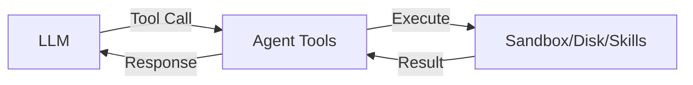

Instead of writing custom tools based on Acontext low-level SDKs, 
Acontext provides ready-to-use tools that integrate seamlessly with popular LLM providers.

## Available Tool Sets

| Tool Set | Description |
|----------|-------------|
| [Sandbox Tools](/tool/bash_tools) | Execute code, edit files, export results |
| [Disk Tools](/tool/disk_tools) | Read and write files to persistent storage |
| [Skill Tools](/tool/skill_tools) | Access agent skills and knowledge |

## How It Works



## Quick Example

<Steps>
<Step title="Init resources">
<CodeGroup>
```python Python
from acontext import AcontextClient
from acontext.agent.sandbox import SANDBOX_TOOLS

client = AcontextClient()
sandbox = client.sandboxes.create()
disk = client.disks.create()
```

```typescript TypeScript
import { AcontextClient, SANDBOX_TOOLS } from '@acontext/acontext';

const client = new AcontextClient();
const sandbox = await client.sandboxes.create();
const disk = await client.disks.create();
```
</CodeGroup>
</Step>

<Step title="Create context for this session">
<CodeGroup>
```python Python
ctx = SANDBOX_TOOLS.format_context(client, sandbox.sandbox_id, disk.id)
```

```typescript TypeScript
const ctx = await SANDBOX_TOOLS.formatContext(client, sandbox.sandbox_id, disk.id);
```
</CodeGroup>
</Step>

<Step title="Inject prompt">
<CodeGroup>
```python Python
context_prompt = ctx.get_context_prompt()
messages = [
    {"role": "system", "content": f"You have sandbox access.\n\n{context_prompt}"},
    {"role": "user", "content": "Run a hello world script"}
]
```

```typescript TypeScript
const contextPrompt = ctx.getContextPrompt();
const messages = [
    { role: "system", content: `You have sandbox access.\n\n${contextPrompt}` },
    { role: "user", content: "Run a hello world script" }
];
```
</CodeGroup>
</Step>

<Step title="Pass tools to LLM">
<CodeGroup>
```python Python
tools = SANDBOX_TOOLS.to_openai_tool_schema()
response = openai_client.chat.completions.create(
    model="gpt-4.1", messages=messages, tools=tools
)
```

```typescript TypeScript
const tools = SANDBOX_TOOLS.toOpenAIToolSchema();
const response = await openai.chat.completions.create({
    model: "gpt-4.1", messages, tools
});
```
</CodeGroup>
</Step>

<Step title="Execute tools">
<CodeGroup>
```python Python
for tc in response.choices[0].message.tool_calls:
    result = SANDBOX_TOOLS.execute_tool(ctx, tc.function.name, json.loads(tc.function.arguments))
```

```typescript TypeScript
for (const tc of response.choices[0].message.tool_calls) {
    const result = await SANDBOX_TOOLS.executeTool(ctx, tc.function.name, JSON.parse(tc.function.arguments));
}
```
</CodeGroup>
</Step>
</Steps>

## Next Steps

<CardGroup cols={2}>
<Card title="Sandbox Tools" icon="terminal" href="/tool/bash_tools">
Execute code in isolated containers
</Card>
<Card title="Disk Tools" icon="hard-drive" href="/tool/disk_tools">
Persistent file storage for agents
</Card>
<Card title="Skill Tools" icon="wand-magic-sparkles" href="/tool/skill_tools">
Access reusable agent skills
</Card>
<Card title="Agent Skills" icon="book" href="/store/skill">
Create and manage skills
</Card>
</CardGroup>
