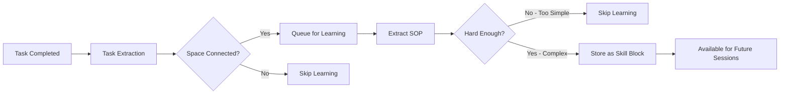

<div align="center">
  <a href="https://discord.acontext.io">
      
  </a>
  <p>
    <h3>Kontext skalieren, Erfahrung lernen</h3>
  </p>
  <p align="center">
    <a href="https://pypi.org/project/acontext/"></a>
    <a href="https://www.npmjs.com/package/@acontext/acontext"></a>
    <a href="https://github.com/memodb-io/acontext/actions/workflows/core-test.yaml"></a>
    <a href="https://github.com/memodb-io/acontext/actions/workflows/api-test.yaml"></a>
    <a href="https://github.com/memodb-io/acontext/actions/workflows/cli-test.yaml"></a>
  </p>
  <p align="center">
    <a href="https://x.com/acontext_io"></a>
    <a href="https://discord.acontext.io"></a>
  </p>
  <div align="center">
    <!-- Keep these links. Translations will automatically update with the README. -->
    <a href="../../readme/de/README.md">Deutsch</a> | 
    <a href="../../readme/es/README.md">Español</a> | 
    <a href="../../readme/fr/README.md">Français</a> | 
    <a href="../../readme/ja/README.md">日本語</a> | 
    <a href="../../readme/ko/README.md">한국어</a> | 
    <a href="../../readme/pt/README.md">Português</a> | 
    <a href="../../readme/ru/README.md">Русский</a> | 
    <a href="../../readme/zh/README.md">中文</a>
  </div>
  <br/>
</div>


Acontext ist eine **Kontextdatenplattform** für **Cloud-native** AI Agent-Anwendungen.

Sie kann:

- **Speichert** Kontexte und Artifacts
- **Beobachtet** Agent Tasks und Benutzerfeedback.
- Ermöglicht **Selbstlernen** von Agents durch Sammeln von Erfahrungen (SOPs) im Langzeitgedächtnis.
- Bietet ein **lokales Dashboard** zum Anzeigen von Nachrichten, Aufgaben, Artifacts und Erfahrungen.


<div align="center">
    <picture>
      
    </picture>
  <p>Speichern, Beobachten und Lernen</p>
</div>


Wir bauen es, weil wir glauben, dass Acontext Ihnen helfen kann:

- **Ein skalierbareres Agent Product zu erstellen**
- **Ihre Agent Success Rate zu verbessern und die Ausführungsschritte zu reduzieren**

damit Ihr Agent stabiler sein und Ihren Benutzern einen größeren Wert bieten kann.


# 🌲 Kernkonzepte

- [**Session**](https://docs.acontext.io/store/messages/multi-provider) - Ein Konversations-Thread, der Nachrichten mit Multi-Modal-Unterstützung speichert. 
  - [**Task Agent**](https://docs.acontext.io/observe/agent_tasks) - Hintergrund TODO Agent, der den Status, Fortschritt und Präferenzen der Aufgabe sammelt.
- [**Disk**](https://docs.acontext.io/store/disk) - Dateispeicher für Agent Artifacts.
- [**Space**](https://docs.acontext.io/learn/skill-space) - Ein Notion-ähnlicher `Space` für Agents, in dem gelernte Fähigkeiten gespeichert werden. 
  - [**Experience Agent**](https://docs.acontext.io/learn/advance/experience-agent) - Hintergrund Agents, die Fähigkeiten destillieren, speichern und durchsuchen.

### Wie sie zusammenarbeiten

```txt
┌──────┐    ┌────────────┐    ┌──────────────┐    ┌───────────────┐
│ User │◄──►│ Your Agent │◄──►│   Session    │    │ Artifact Disk │
└──────┘    └─────▲──────┘    └──────┬───────┘    └───────────────┘
                  │                  │
                  │         ┌────────▼────────┐
                  │         │ Observed Tasks  │
                  │         └────────┬────────┘
                  │                  │
                  │         ┌────────▼────────┐
                  │         │  Space (learn)  │ # or wait for user confirmation
                  │         └────────┬────────┘
                  │                  │
                  └──────────────────┘
                  Fähigkeiten leiten den Agent
```

Ihre Agent Skills sehen so aus:

```json
{
    "use_when": "star a repo on github.com",
    "preferences": "use personal account. star but not fork",
    "tool_sops": [
        {"tool_name": "goto", "action": "goto github.com"},
        {"tool_name": "click", "action": "find login button if any. login first"},
        ...
    ]
}
```


Agent Experiences werden in einem strukturierten `Space` gespeichert, mit Ordnern, Seiten und Blöcken. Zum Beispiel:

```txt
/
└── github/ (folder)
    └── GTM (page)
        ├── find_trending_repos (sop block)
        └── find_contributor_emails (sop block)
    └── basic_ops (page)
        ├── create_repo (sop block)
        └── delete_repo (sop block)
    ...
```


# 🚀 Wie startet man?

Wir haben ein `acontext-cli`, um Ihnen bei einem schnellen Proof-of-Concept zu helfen. Laden Sie es zuerst in Ihrem Terminal herunter:

```bash
curl -fsSL https://install.acontext.io | sh
```

Sie sollten [docker](https://www.docker.com/get-started/) installiert haben und einen OpenAI API-Schlüssel besitzen, um ein Acontext-Backend auf Ihrem Computer zu starten:

```bash
mkdir acontext_server && cd acontext_server
acontext docker up
```

> [📖 lokale Einrichtung](https://docs.acontext.io/local#start-acontext-server-locally) Acontext benötigt mindestens einen OpenAI API-Schlüssel. Wir empfehlen `gpt-5.1` oder `gpt-4.1` als LLM-Modell

`acontext docker up` wird `.env` und `config.yaml` für Acontext erstellen/verwenden und einen `db`-Ordner erstellen, um Daten zu speichern.


Sobald es fertig ist, können Sie auf die folgenden Endpunkte zugreifen:

- Acontext API Base URL: http://localhost:8029/api/v1
- Acontext Dashboard: http://localhost:3000/


<div align="center">
    <picture>
      
    </picture>
  <p>Dashboard für Erfolgsrate und andere Metriken</p>
</div>


# 🧐 Wie verwendet man es?

Laden Sie End-to-End-Skripte mit `acontext` herunter:

**Python**

```bash
acontext create my-proj --template-path "python/openai-basic"
```

> Weitere Beispiele für Python:
>
> - `python/openai-agent-basic`: Selbstlernender Agent im OpenAI Agent SDK.
> - `python/agno-basic`: Selbstlernender Agent im Agno Framework.
> - `python/openai-agent-artifacts`: Agent, der Artifacts bearbeiten und herunterladen kann.

**Typescript**

```bash
acontext create my-proj --template-path "typescript/openai-basic"
```

> Weitere Beispiele für Typescript:
>
> - `typescript/vercel-ai-basic`: Selbstlernender Agent in @vercel/ai-sdk


Schauen Sie sich unser Beispiel-Repository für weitere Vorlagen an: [Acontext-Examples](https://github.com/memodb-io/Acontext-Examples).


## Schritt-für-Schritt-Erklärung

<details>
<summary>Zum Öffnen klicken</summary>


Wir pflegen Python [](https://pypi.org/project/acontext/) und Typescript [](https://www.npmjs.com/package/@acontext/acontext) SDKs. Die folgenden Code-Snippets verwenden Python.

## SDKs installieren

```
pip install acontext # for Python
npm i @acontext/acontext # for Typescript
```


## Client initialisieren

```python
from acontext import AcontextClient

client = AcontextClient(
    base_url="http://localhost:8029/api/v1",
    api_key="sk-ac-your-root-api-bearer-token"
)
client.ping()

# yes, the default api_key is sk-ac-your-root-api-bearer-token
```

> [📖 async client doc](https://docs.acontext.io/settings/core)


## Speichern

Acontext kann Agent Sessions und Artifacts verwalten.

### Nachrichten speichern [📖](https://docs.acontext.io/api-reference/session/send-message-to-session)

Acontext bietet persistente Speicherung für Nachrichtendaten. Wenn Sie `session.send_message` aufrufen, speichert Acontext die Nachricht und beginnt, diese Sitzung zu überwachen:

<details>
<summary>Code-Snippet</summary>

```python
session = client.sessions.create()

messages = [
    {"role": "user", "content": "I need to write a landing page of iPhone 15 pro max"},
    {
        "role": "assistant",
        "content": "Sure, my plan is below:\n1. Search for the latest news about iPhone 15 pro max\n2. Init Next.js project for the landing page\n3. Deploy the landing page to the website",
    }
]

# Save messages
for msg in messages:
    client.sessions.send_message(session_id=session.id, blob=msg, format="openai")
```

> [📖](https://docs.acontext.io/store/messages/multi-modal) Wir unterstützen auch Multi-Modal-Nachrichtenspeicherung und anthropic SDK.


</details>

### Nachrichten laden [📖](https://docs.acontext.io/api-reference/session/get-messages-from-session)

Rufen Sie Ihre Sitzungsnachrichten mit `sessions.get_messages` ab

<details>
<summary>Code-Snippet</summary>

```python
r = client.sessions.get_messages(session.id)
new_msg = r.items

new_msg.append({"role": "user", "content": "How are you doing?"})
r = openai_client.chat.completions.create(model="gpt-4.1", messages=new_msg)
print(r.choices[0].message.content)
client.sessions.send_message(session_id=session.id, blob=r.choices[0].message)
```

</details>

<div align="center">
    <picture>
      
    </picture>
  <p>Sie können Sitzungen in Ihrem lokalen Dashboard anzeigen</p>
</div>


### Artifacts [📖](https://docs.acontext.io/store/disk)

Erstellen Sie eine Festplatte für Ihren Agent, um Artifacts mit Dateipfaden zu speichern und zu lesen:

<details>
<summary>Code-Snippet</summary>

```python
from acontext import FileUpload

disk = client.disks.create()

file = FileUpload(
    filename="todo.md",
    content=b"# Sprint Plan\n\n## Goals\n- Complete user authentication\n- Fix critical bugs"
)
artifact = client.disks.artifacts.upsert(
    disk.id,
    file=file,
    file_path="/todo/"
)


print(client.disks.artifacts.list(
    disk.id,
    path="/todo/"
))

result = client.disks.artifacts.get(
    disk.id,
    file_path="/todo/",
    filename="todo.md",
    with_public_url=True,
    with_content=True
)
print(f"✓ File content: {result.content.raw}")
print(f"✓ Download URL: {result.public_url}")        
```
</details>


<div align="center">
    <picture>
      
    </picture>
  <p>Sie können Artifacts in Ihrem lokalen Dashboard anzeigen</p>
</div>


## Beobachten [📖](https://docs.acontext.io/observe)

Für jede Sitzung startet Acontext **automatisch** einen Hintergrund Agent, um den Aufgabenfortschritt und das Benutzerfeedback zu verfolgen. **Es ist wie ein Hintergrund TODO Agent**. Acontext verwendet ihn, um Ihre tägliche Agent Success Rate zu beobachten.

Sie können das SDK verwenden, um den aktuellen Status der Agent Session abzurufen, für Context Engineering wie Reduktion und Kompression. 

<details>
<summary>Vollständiges Skript</summary>

```python
from acontext import AcontextClient

# Initialize client
client = AcontextClient(
    base_url="http://localhost:8029/api/v1", api_key="sk-ac-your-root-api-bearer-token"
)

# Create a project and session
session = client.sessions.create()

# Conversation messages
messages = [
    {"role": "user", "content": "I need to write a landing page of iPhone 15 pro max"},
    {
        "role": "assistant",
        "content": "Sure, my plan is below:\n1. Search for the latest news about iPhone 15 pro max\n2. Init Next.js project for the landing page\n3. Deploy the landing page to the website",
    },
    {
        "role": "user",
        "content": "That sounds good. Let's first collect the message and report to me before any landing page coding.",
    },
    {
        "role": "assistant",
        "content": "Sure, I will first collect the message then report to you before any landing page coding.",
      	"tool_calls": [
            {
                "id": "call_001",
                "type": "function",
                "function": {
                    "name": "search_news",
                    "arguments": "{\"query\": \"iPhone news\"}"
                }
            }
        ]
    },
]

# Send messages in a loop
for msg in messages:
    client.sessions.send_message(session_id=session.id, blob=msg, format="openai")

# Wait for task extraction to complete
client.sessions.flush(session.id)

# Display extracted tasks
tasks_response = client.sessions.get_tasks(session.id)
print(tasks_response)
for task in tasks_response.items:
    print(f"\nTask #{task.order}:")
    print(f"  ID: {task.id}")
    print(f"  Title: {task.data['task_description']}")
    print(f"  Status: {task.status}")

    # Show progress updates if available
    if "progresses" in task.data:
        print(f"  Progress updates: {len(task.data['progresses'])}")
        for progress in task.data["progresses"]:
            print(f"    - {progress}")

    # Show user preferences if available
    if "user_preferences" in task.data:
        print("  User preferences:")
        for pref in task.data["user_preferences"]:
            print(f"    - {pref}")

```
> `flush` ist ein blockierender Aufruf, der auf den Abschluss der Aufgabenextraktion wartet.
> Sie müssen ihn in der Produktion nicht aufrufen, Acontext hat einen Puffer-Mechanismus, um sicherzustellen, dass die Aufgabenextraktion rechtzeitig abgeschlossen wird.

</details>

Beispiel-Aufgabenrückgabe:

```txt
Task #1:
  Title: Search for the latest news about iPhone 15 Pro Max and report findings to the user before any landing page coding.
  Status: success
  Progress updates: 2
    - I confirmed that the first step will be reporting before moving on to landing page development.
    - I have already collected all the iPhone 15 pro max info and reported to the user, waiting for approval for next step.
  User preferences:
    - user expects a report on latest news about iPhone 15 pro max before any coding work on the landing page.

Task #2:
  Title: Initialize a Next.js project for the iPhone 15 Pro Max landing page.
  Status: pending

Task #3:
  Title: Deploy the completed landing page to the website.
  Status: pending
```


Sie können die Status der Sitzungsaufgaben im Dashboard anzeigen:

<div align="center">
    <picture>
      
    </picture>
  <p>Eine Aufgaben-Demo</p>
</div>


## Selbstlernen

Acontext kann eine Reihe von Sitzungen sammeln und Fähigkeiten (SOPs) lernen, wie man Tools für bestimmte Aufgaben aufruft.

### Fähigkeiten in einem `Space` lernen [📖](https://docs.acontext.io/learn/skill-space)

Ein `Space` kann Fähigkeiten, Erfahrungen und Erinnerungen in einem Notion-ähnlichen System speichern. Sie müssen zuerst eine Sitzung mit `Space` verbinden, um den Lernprozess zu aktivieren:

```python
# Step 1: Create a Space for skill learning
space = client.spaces.create()
print(f"Created Space: {space.id}")

# Step 2: Create a session attached to the space
session = client.sessions.create(space_id=space.id)

# ... push the agent working context
```

Das Lernen erfolgt im Hintergrund und ist nicht in Echtzeit (Verzögerung etwa 10-30 Sekunden). 

Was Acontext im Hintergrund tun wird:



Schließlich werden SOP-Blöcke mit Tool-Call-Muster in `Space` gespeichert. Sie können jeden `Space` im Dashboard anzeigen:

<div align="center">
    <picture>
      
    </picture>
  <p>Eine Space-Demo</p>
</div>


### Fähigkeiten aus einem `Space` durchsuchen [📖](https://docs.acontext.io/learn/search-skills)

Um Fähigkeiten aus einem `Space` zu durchsuchen und in der nächsten Sitzung zu verwenden:

```python
result = client.spaces.experience_search(
    space_id=space.id,
    query="I need to implement authentication",
  	mode="fast"
)
```

Acontext unterstützt `fast` und `agentic` Modi für die Suche. Ersteres verwendet Embeddings, um Fähigkeiten abzugleichen. Letzteres verwendet einen Experience Agent, um den gesamten `Space` zu erkunden und versucht, jede benötigte Fähigkeit abzudecken.

Die Rückgabe ist eine Liste von sop-Blöcken, die wie folgt aussehen:

```json
{
    "use_when": "star a github repo",
    "preferences": "use personal account. star but not fork",
    "tool_sops": [
        {"tool_name": "goto", "action": "goto the user given github repo url"},
        {"tool_name": "click", "action": "find login button if any, and start to login first"},
        ...
    ]
}
```

</details>


# 🔍 Dokumentation

Um besser zu verstehen, was Acontext kann, sehen Sie sich [unsere Dokumentation](https://docs.acontext.io/) an


# ❤️ Auf dem Laufenden bleiben

Markieren Sie Acontext auf Github mit einem Stern, um zu unterstützen und sofortige Benachrichtigungen zu erhalten 


# 🤝 Zusammen bleiben

Treten Sie der Community bei, um Unterstützung und Diskussionen zu erhalten:

-   [Diskutieren Sie mit Buildern auf Acontext Discord](https://discord.acontext.io) 👻 
-  [Folgen Sie Acontext auf X](https://x.com/acontext_io) 𝕏 


# 🌟 Beitragen

- Schauen Sie sich zuerst unser [roadmap.md](../../ROADMAP.md) an.
- Lesen Sie [contributing.md](../../CONTRIBUTING.md)


# 📑 LIZENZ

Dieses Projekt ist derzeit unter [Apache License 2.0](LICENSE) lizenziert.


# 🥇 Abzeichen

 

```md
[](https://acontext.io)

[](https://acontext.io)
```

