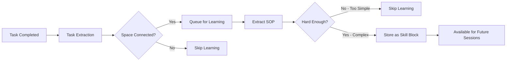

<div align="center">
  <a href="https://discord.acontext.io">
      
  </a>
  <p>
    <h3>Mettre à l'échelle le Contexte, Apprendre l'Expérience</h3>
  </p>
  <p align="center">
    <a href="https://pypi.org/project/acontext/"></a>
    <a href="https://www.npmjs.com/package/@acontext/acontext"></a>
    <a href="https://github.com/memodb-io/acontext/actions/workflows/core-test.yaml"></a>
    <a href="https://github.com/memodb-io/acontext/actions/workflows/api-test.yaml"></a>
    <a href="https://github.com/memodb-io/acontext/actions/workflows/cli-test.yaml"></a>
  </p>
  <p align="center">
    <a href="https://x.com/acontext_io"></a>
    <a href="https://discord.acontext.io"></a>
  </p>
  <div align="center">
    <!-- Keep these links. Translations will automatically update with the README. -->
    <a href="../../readme/de/README.md">Deutsch</a> | 
    <a href="../../readme/es/README.md">Español</a> | 
    <a href="../../readme/fr/README.md">Français</a> | 
    <a href="../../readme/ja/README.md">日本語</a> | 
    <a href="../../readme/ko/README.md">한국어</a> | 
    <a href="../../readme/pt/README.md">Português</a> | 
    <a href="../../readme/ru/README.md">Русский</a> | 
    <a href="../../readme/zh/README.md">中文</a>
  </div>
  <br/>
</div>


Acontext est une **plateforme de données contextuelles** pour les applications d'Agents IA **cloud-native**.

Elle peut :

- **Stocke** les contextes et artefacts
- **Observe** les tâches des agents et les retours des utilisateurs.
- Permet l'**auto-apprentissage** des agents en collectant des expériences (SOPs) dans la mémoire à long terme.
- Offre un **Tableau de bord local** pour visualiser les messages, tâches, artefacts et expériences.


<div align="center">
    <picture>
      
    </picture>
  <p>Stocker, Observer et Apprendre</p>
</div>


Nous le construisons car nous croyons qu'Acontext peut vous aider à :

- **Construire un produit d'agent plus évolutif**
- **Améliorer votre taux de réussite des agents et réduire les étapes d'exécution**

afin que votre agent puisse être plus stable et fournir une plus grande valeur à vos utilisateurs.


# 🌲 Concepts Centraux

- [**Session**](https://docs.acontext.io/store/messages/multi-provider) - Un fil de conversation qui stocke les messages avec support multi-modal. 
  - [**Task Agent**](https://docs.acontext.io/observe/agent_tasks) - Agent TODO en arrière-plan qui collecte le statut, la progression et les préférences de la tâche.
- [**Disk**](https://docs.acontext.io/store/disk) - Stockage de fichiers pour les artefacts des agents.
- [**Space**](https://docs.acontext.io/learn/skill-space) - Un `Space` similaire à Notion pour les agents, où les compétences apprises sont stockées. 
  - [**Experience Agent**](https://docs.acontext.io/learn/advance/experience-agent) - Agents en arrière-plan qui distillent, sauvegardent et recherchent des compétences.

### Comment Ils Fonctionnent Ensemble

```txt
┌──────┐    ┌────────────┐    ┌──────────────┐    ┌───────────────┐
│ User │◄──►│ Your Agent │◄──►│   Session    │    │ Artifact Disk │
└──────┘    └─────▲──────┘    └──────┬───────┘    └───────────────┘
                  │                  │
                  │         ┌────────▼────────┐
                  │         │ Observed Tasks  │
                  │         └────────┬────────┘
                  │                  │
                  │         ┌────────▼────────┐
                  │         │  Space (learn)  │ # or wait for user confirmation
                  │         └────────┬────────┘
                  │                  │
                  └──────────────────┘
                  Les compétences guident l'agent
```

Vos compétences d'agent ressemblent à :

```json
{
    "use_when": "star a repo on github.com",
    "preferences": "use personal account. star but not fork",
    "tool_sops": [
        {"tool_name": "goto", "action": "goto github.com"},
        {"tool_name": "click", "action": "find login button if any. login first"},
        ...
    ]
}
```


L'expérience de l'agent sera stockée dans un `Space` structuré, avec des dossiers, des pages et des blocs. Par exemple :

```txt
/
└── github/ (folder)
    └── GTM (page)
        ├── find_trending_repos (sop block)
        └── find_contributor_emails (sop block)
    └── basic_ops (page)
        ├── create_repo (sop block)
        └── delete_repo (sop block)
    ...
```


# 🚀 Comment Commencer ?

Nous avons un `acontext-cli` pour vous aider à faire une preuve de concept rapide. Téléchargez-le d'abord dans votre terminal :

```bash
curl -fsSL https://install.acontext.io | sh
```

Vous devriez avoir [docker](https://www.docker.com/get-started/) installé et une Clé API OpenAI pour démarrer un backend Acontext sur votre ordinateur :

```bash
mkdir acontext_server && cd acontext_server
acontext docker up
```

> [📖 configuration locale](https://docs.acontext.io/local#start-acontext-server-locally) Acontext nécessite au moins une Clé API OpenAI. Nous recommandons `gpt-5.1` ou `gpt-4.1` comme modèle LLM

`acontext docker up` créera/utilisera `.env` et `config.yaml` pour Acontext, et créera un dossier `db` pour persister les données.


Une fois terminé, vous pouvez accéder aux endpoints suivants :

- Acontext API Base URL: http://localhost:8029/api/v1
- Acontext Dashboard: http://localhost:3000/


<div align="center">
    <picture>
      
    </picture>
  <p>Tableau de bord du Taux de Réussite et autres Métriques</p>
</div>


# 🧐 Comment l'Utiliser ?

Téléchargez des scripts de bout en bout avec `acontext` :

**Python**

```bash
acontext create my-proj --template-path "python/openai-basic"
```

> Plus d'exemples sur Python :
>
> - `python/openai-agent-basic`: agent auto-apprenant dans openai agent sdk.
> - `python/agno-basic`: agent auto-apprenant dans agno framework.
> - `python/openai-agent-artifacts`: agent capable de modifier et télécharger des artefacts.

**Typescript**

```bash
acontext create my-proj --template-path "typescript/openai-basic"
```

> Plus d'exemples sur Typescript :
>
> - `typescript/vercel-ai-basic`: agent auto-apprenant dans @vercel/ai-sdk


Consultez notre dépôt d'exemples pour plus de modèles : [Acontext-Examples](https://github.com/memodb-io/Acontext-Examples).


## Explication Étape par Étape

<details>
<summary>Cliquez pour Ouvrir</summary>


Nous maintenons les SDKs Python [](https://pypi.org/project/acontext/) et Typescript [](https://www.npmjs.com/package/@acontext/acontext). Les extraits de code ci-dessous utilisent Python.

## Installer les SDKs

```
pip install acontext # for Python
npm i @acontext/acontext # for Typescript
```


## Initialiser le Client

```python
from acontext import AcontextClient

client = AcontextClient(
    base_url="http://localhost:8029/api/v1",
    api_key="sk-ac-your-root-api-bearer-token"
)
client.ping()

# yes, the default api_key is sk-ac-your-root-api-bearer-token
```

> [📖 async client doc](https://docs.acontext.io/settings/core)


## Stocker

Acontext peut gérer les sessions d'agents et les artefacts.

### Enregistrer les Messages [📖](https://docs.acontext.io/api-reference/session/send-message-to-session)

Acontext offre un stockage persistant pour les données de messages. Lorsque vous appelez `session.send_message`, Acontext persistera le message et commencera à surveiller cette session :

<details>
<summary>Extrait de Code</summary>

```python
session = client.sessions.create()

messages = [
    {"role": "user", "content": "I need to write a landing page of iPhone 15 pro max"},
    {
        "role": "assistant",
        "content": "Sure, my plan is below:\n1. Search for the latest news about iPhone 15 pro max\n2. Init Next.js project for the landing page\n3. Deploy the landing page to the website",
    }
]

# Save messages
for msg in messages:
    client.sessions.send_message(session_id=session.id, blob=msg, format="openai")
```

> [📖](https://docs.acontext.io/store/messages/multi-modal) Nous prenons également en charge le stockage de messages multi-modaux et le SDK anthropic.


</details>

### Charger les Messages [📖](https://docs.acontext.io/api-reference/session/get-messages-from-session)

Obtenez les messages de votre session en utilisant `sessions.get_messages`

<details>
<summary>Extrait de Code</summary>

```python
r = client.sessions.get_messages(session.id)
new_msg = r.items

new_msg.append({"role": "user", "content": "How are you doing?"})
r = openai_client.chat.completions.create(model="gpt-4.1", messages=new_msg)
print(r.choices[0].message.content)
client.sessions.send_message(session_id=session.id, blob=r.choices[0].message)
```

</details>

<div align="center">
    <picture>
      
    </picture>
  <p>Vous pouvez visualiser les sessions dans votre Tableau de bord local</p>
</div>


### Artefacts [📖](https://docs.acontext.io/store/disk)

Créez un disque pour votre agent pour stocker et lire des artefacts en utilisant des chemins de fichiers :

<details>
<summary>Extrait de Code</summary>

```python
from acontext import FileUpload

disk = client.disks.create()

file = FileUpload(
    filename="todo.md",
    content=b"# Sprint Plan\n\n## Goals\n- Complete user authentication\n- Fix critical bugs"
)
artifact = client.disks.artifacts.upsert(
    disk.id,
    file=file,
    file_path="/todo/"
)


print(client.disks.artifacts.list(
    disk.id,
    path="/todo/"
))

result = client.disks.artifacts.get(
    disk.id,
    file_path="/todo/",
    filename="todo.md",
    with_public_url=True,
    with_content=True
)
print(f"✓ File content: {result.content.raw}")
print(f"✓ Download URL: {result.public_url}")        
```
</details>


<div align="center">
    <picture>
      
    </picture>
  <p>Vous pouvez visualiser les artefacts dans votre Tableau de bord local</p>
</div>


## Observer [📖](https://docs.acontext.io/observe)

Pour chaque session, Acontext lancera **automatiquement** un agent en arrière-plan pour suivre la progression des tâches et les retours des utilisateurs. **C'est comme un agent TODO en arrière-plan**. Acontext l'utilisera pour observer votre taux de réussite quotidien des agents.

Vous pouvez utiliser le SDK pour récupérer l'état actuel de la session de l'agent, pour Context Engineering comme Réduction et Compression. 

<details>
<summary>Script Complet</summary>

```python
from acontext import AcontextClient

# Initialize client
client = AcontextClient(
    base_url="http://localhost:8029/api/v1", api_key="sk-ac-your-root-api-bearer-token"
)

# Create a project and session
session = client.sessions.create()

# Conversation messages
messages = [
    {"role": "user", "content": "I need to write a landing page of iPhone 15 pro max"},
    {
        "role": "assistant",
        "content": "Sure, my plan is below:\n1. Search for the latest news about iPhone 15 pro max\n2. Init Next.js project for the landing page\n3. Deploy the landing page to the website",
    },
    {
        "role": "user",
        "content": "That sounds good. Let's first collect the message and report to me before any landing page coding.",
    },
    {
        "role": "assistant",
        "content": "Sure, I will first collect the message then report to you before any landing page coding.",
      	"tool_calls": [
            {
                "id": "call_001",
                "type": "function",
                "function": {
                    "name": "search_news",
                    "arguments": "{\"query\": \"iPhone news\"}"
                }
            }
        ]
    },
]

# Send messages in a loop
for msg in messages:
    client.sessions.send_message(session_id=session.id, blob=msg, format="openai")

# Wait for task extraction to complete
client.sessions.flush(session.id)

# Display extracted tasks
tasks_response = client.sessions.get_tasks(session.id)
print(tasks_response)
for task in tasks_response.items:
    print(f"\nTask #{task.order}:")
    print(f"  ID: {task.id}")
    print(f"  Title: {task.data['task_description']}")
    print(f"  Status: {task.status}")

    # Show progress updates if available
    if "progresses" in task.data:
        print(f"  Progress updates: {len(task.data['progresses'])}")
        for progress in task.data["progresses"]:
            print(f"    - {progress}")

    # Show user preferences if available
    if "user_preferences" in task.data:
        print("  User preferences:")
        for pref in task.data["user_preferences"]:
            print(f"    - {pref}")

```
> `flush` est un appel bloquant, il attendra que l'extraction de la tâche soit terminée.
> Vous n'avez pas besoin de l'appeler en production, Acontext a un mécanisme de tampon pour s'assurer que l'extraction de la tâche est terminée au bon moment.

</details>

Exemple de Retour de Tâche :

```txt
Task #1:
  Title: Search for the latest news about iPhone 15 Pro Max and report findings to the user before any landing page coding.
  Status: success
  Progress updates: 2
    - I confirmed that the first step will be reporting before moving on to landing page development.
    - I have already collected all the iPhone 15 pro max info and reported to the user, waiting for approval for next step.
  User preferences:
    - user expects a report on latest news about iPhone 15 pro max before any coding work on the landing page.

Task #2:
  Title: Initialize a Next.js project for the iPhone 15 Pro Max landing page.
  Status: pending

Task #3:
  Title: Deploy the completed landing page to the website.
  Status: pending
```


Vous pouvez visualiser les statuts des tâches de session dans le Tableau de bord :

<div align="center">
    <picture>
      
    </picture>
  <p>Une Démonstration de Tâche</p>
</div>


## Auto-apprentissage

Acontext peut collecter un tas de sessions et apprendre des compétences (SOPs) sur la façon d'appeler des outils pour certaines tâches.

### Apprendre des Compétences dans un `Space` [📖](https://docs.acontext.io/learn/skill-space)

Un `Space` peut stocker des compétences, des expériences et des souvenirs dans un système similaire à Notion. Vous devez d'abord connecter une session à `Space` pour activer le processus d'apprentissage :

```python
# Step 1: Create a Space for skill learning
space = client.spaces.create()
print(f"Created Space: {space.id}")

# Step 2: Create a session attached to the space
session = client.sessions.create(space_id=space.id)

# ... push the agent working context
```

L'apprentissage se produit en arrière-plan et n'est pas en temps réel (délai d'environ 10-30 secondes). 

Ce qu'Acontext fera en arrière-plan :



Finalement, les blocs SOP avec un modèle d'appel d'outil seront sauvegardés dans `Space`. Vous pouvez visualiser chaque `Space` dans le Tableau de bord :

<div align="center">
    <picture>
      
    </picture>
  <p>Une Démonstration de Space</p>
</div>


### Rechercher des Compétences depuis un `Space` [📖](https://docs.acontext.io/learn/search-skills)

Pour rechercher des compétences depuis un `Space` et les utiliser dans la prochaine session :

```python
result = client.spaces.experience_search(
    space_id=space.id,
    query="I need to implement authentication",
  	mode="fast"
)
```

Acontext prend en charge les modes `fast` et `agentic` pour la recherche. Le premier utilise des embeddings pour faire correspondre les compétences. Le second utilise un Experience Agent pour explorer tout le `Space` et tente de couvrir chaque compétence nécessaire.

Le retour est une liste de blocs sop, qui ressemblent à ceci :

```json
{
    "use_when": "star a github repo",
    "preferences": "use personal account. star but not fork",
    "tool_sops": [
        {"tool_name": "goto", "action": "goto the user given github repo url"},
        {"tool_name": "click", "action": "find login button if any, and start to login first"},
        ...
    ]
}
```

</details>


# 🔍 Documentation

Pour mieux comprendre ce qu'Acontext peut faire, veuillez consulter [notre documentation](https://docs.acontext.io/)


# ❤️ Restez à Jour

Marquez Acontext d'une étoile sur Github pour soutenir et recevoir des notifications instantanées 


# 🤝 Restons Ensemble

Rejoignez la communauté pour obtenir du soutien et des discussions :

-   [Discutez avec les Constructeurs sur Acontext Discord](https://discord.acontext.io) 👻 
-  [Suivez Acontext sur X](https://x.com/acontext_io) 𝕏 


# 🌟 Contribution

- Consultez d'abord notre [roadmap.md](../../ROADMAP.md).
- Lisez [contributing.md](../../CONTRIBUTING.md)


# 📑 LICENCE

Ce projet est actuellement sous licence [Apache License 2.0](LICENSE).


# 🥇 Badges

 

```md
[](https://acontext.io)

[](https://acontext.io)
```

