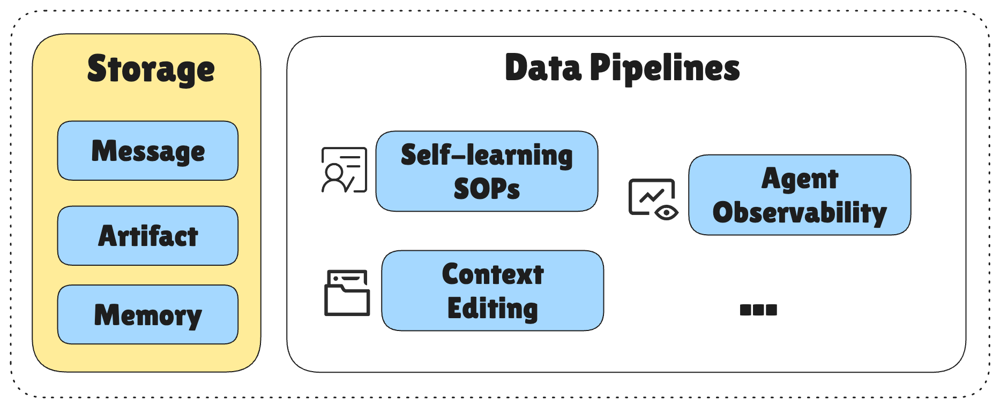
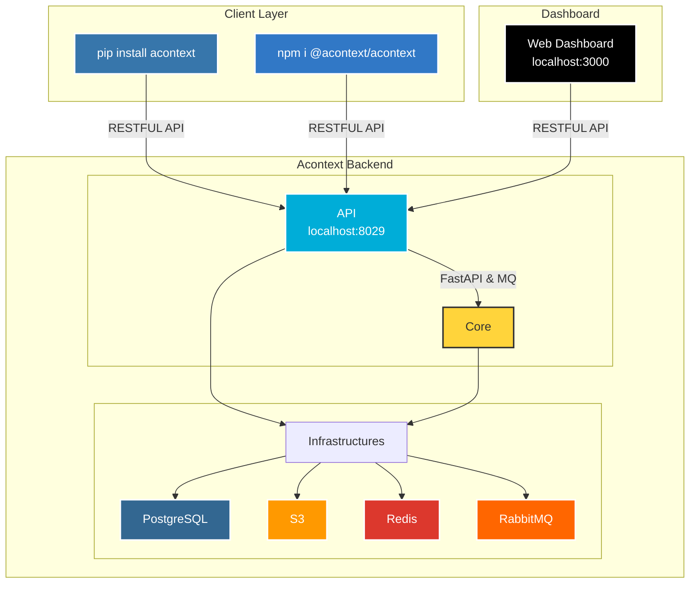
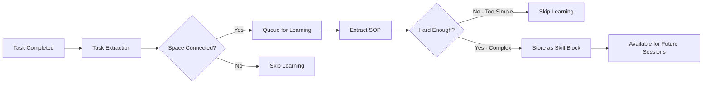

<div align="center">
  <a href="https://discord.acontext.io">
      
  </a>
  <p>
    <h4>Context Data Platform for Building Cloud-native AI Agents</h4>
  </p>
  <p align="center">
    <a href="https://pypi.org/project/acontext/"></a>
    <a href="https://www.npmjs.com/package/@acontext/acontext"></a>
    <a href="https://github.com/memodb-io/acontext/actions/workflows/core-test.yaml"></a>
    <a href="https://github.com/memodb-io/acontext/actions/workflows/api-test.yaml"></a>
    <a href="https://github.com/memodb-io/acontext/actions/workflows/cli-test.yaml"></a>
  </p>
  <p align="center">
    <a href="https://x.com/acontext_io"></a>
    <a href="https://discord.acontext.io"></a>
  </p>
  <div align="center">
    <!-- Keep these links. Translations will automatically update with the README. -->
    <a href="../../readme/de/README.md">Deutsch</a> | 
    <a href="../../readme/es/README.md">Español</a> | 
    <a href="../../readme/fr/README.md">Français</a> | 
    <a href="../../readme/ja/README.md">日本語</a> | 
    <a href="../../readme/ko/README.md">한국어</a> | 
    <a href="../../readme/pt/README.md">Português</a> | 
    <a href="../../readme/ru/README.md">Русский</a> | 
    <a href="../../readme/zh/README.md">中文</a>
  </div>
  <br/>
</div>


*Все рассказывают вам, как использовать их агентов. Но если ВАМ нужно создать агента для 100 000 пользователей, с чего бы вы начали?*

**📦 Проблема 1: 99% вашей БД — это сообщения LLM.** 

> Плохой дизайн схемы делает ваши самые ценные данные дорогими и медленными. Acontext обрабатывает хранение и извлечение контекста через PG, Redis и S3.
>
> ChatGPT, Gemini, Anthropic, изображения, аудио, файлы... мы всё охватываем.

**⏰ Проблема 2: Долго работающие агенты — это кошмар.** 

> Вы знаете контекстный инжиниринг, но всегда пишете его с нуля. Acontext поставляется со встроенными методами редактирования контекста и готовым todo агентом.
>
> Управление состоянием агента? Пара пустяков.

**👀 Проблема 3: Вы не видите, как работает ваш агент.** 

> Насколько довольны ваши пользователи на самом деле? Acontext отслеживает задачи по сессиям и показывает вам реальную успешность вашего агента.
>
> Перестаньте зацикливаться на стоимости токенов, сначала улучшите агента.

**🧠 Проблема 4: Ваш агент работает непредсказуемо.**

> Может ли он учиться на своих успехах? Experience агент Acontext запоминает успешные выполнения и превращает их в повторно используемые SOP использования инструментов.
>
> Последовательность — это всё.


Чтобы решить эти проблемы сразу, Acontext становится **Платформой Данных Контекста**:

<div align="center">
    <picture>
      
    </picture>
  <p>Платформа Данных Контекста, которая Хранит, Наблюдает и Учится</p>
</div>


# 💡 Основные Функции

- **Context Engineering**
  - [Session](https://docs.acontext.io/store/messages/multi-provider): единое хранилище сообщений для любого LLM, любой модальности.
  - [Disk](https://docs.acontext.io/store/disk): сохранение/загрузка артефактов с путём к файлу.
  - [Context Editing](https://docs.acontext.io/store/editing) - управление контекстным окном в одном API.

<div align="center">
    <picture>
      
    </picture>
  <p>Context Engineering в Acontext</p>
</div>

- **Наблюдать за задачами агента и обратной связью пользователей**
  - [Task](https://docs.acontext.io/observe/agent_tasks): сбор рабочего статуса агента, прогресса и предпочтений почти в реальном времени.
- **Самообучение агента**
  - [Experience](https://docs.acontext.io/learn/advance/experience-agent): позволяет агенту изучать SOP для каждого пользователя.
- **Просматривать всё в одной [панели управления](https://docs.acontext.io/observe/dashboard)**

<div align="center">
    <picture>
      
    </picture>
  <p>Панель управления успешностью Agent и другими метриками</p>
</div>


# 🏗️ Как это работает?

<details>
<summary>нажмите, чтобы открыть</summary>



## Как Они Работают Вместе

```txt
┌──────┐    ┌────────────┐    ┌──────────────┐    ┌───────────────┐
│ User │◄──►│ Your Agent │◄──►│   Session    │    │ Artifact Disk │
└──────┘    └─────▲──────┘    └──────┬───────┘    └───────────────┘
                  │                  │ # if enable
                  │         ┌────────▼────────┐
                  │         │ Observed Tasks  │
                  │         └────────┬────────┘
                  │                  │ # if enable
                  │         ┌────────▼────────┐
                  │         │   Learn Skills  │
                  │         └────────┬────────┘
                  └──────────────────┘
                      Search skills
```


## Структуры Данных

<details>
<summary>📖 Структура Задачи</summary>

```json
{
  "task_description": "Star https://github.com/memodb-io/Acontext",
  "progresses": [
    "I have navigated to Acontext repo",
    "Tried to Star but a pop-up required me to login",
    ...
  ],
  "user_preferences": [
    "user wants to use outlook email to login"
  ]
}
```
</details>


<details>
<summary>📖 Структура Навыка</summary>


```json
{
    "use_when": "star a repo on github.com",
    "preferences": "use user's outlook account",
    "tool_sops": [
        {"tool_name": "goto", "action": "goto github.com"},
        {"tool_name": "click", "action": "find login button if any. login first"},
        ...
    ]
}
```

</details>


<details>
<summary>📖 Структура Space</summary>

```txt
/
└── github/ (folder)
    └── GTM (page)
        ├── find_trending_repos (sop)
        └── find_contributor_emails (sop)
    └── basic_ops (page)
        ├── create_repo (sop)
        └── delete_repo (sop)
    ...
```
</details>

</details>


# 🚀 Подключиться к Acontext

1. Перейдите на [Acontext.io](https://acontext.io), получите бесплатные кредиты.
2. Пройдите onboarding в один клик, чтобы получить свой API Key: `sk-ac-xxx`

<div align="center">
    <picture>
      
    </picture>
</div>


<details>
<summary>💻 Самостоятельный хостинг Acontext</summary>

У нас есть `acontext-cli`, чтобы помочь вам быстро провести проверку концепции. Сначала загрузите его в терминале:

```bash
curl -fsSL https://install.acontext.io | sh
```

У вас должен быть установлен [docker](https://www.docker.com/get-started/) и OpenAI API Key для запуска бэкенда Acontext на вашем компьютере:

```bash
mkdir acontext_server && cd acontext_server
acontext docker up
```

> [!IMPORTANT]
>
> Убедитесь, что ваш LLM имеет возможность [вызывать инструменты](https://platform.openai.com/docs/guides/function-calling). По умолчанию Acontext будет использовать `gpt-4.1`.

`acontext docker up` создаст/использует `.env` и `config.yaml` для Acontext и создаст папку `db` для сохранения данных.


После завершения вы можете получить доступ к следующим конечным точкам:

- Acontext API Base URL: http://localhost:8029/api/v1
- Acontext Dashboard: http://localhost:3000/

</details>


# 🧐 Использовать Acontext для создания Agent

Загрузите скрипты от начала до конца с помощью `acontext`:

**Python**

```bash
acontext create my-proj --template-path "python/openai-basic"
```

> Больше примеров на Python:
>
> - `python/openai-agent-basic`: самообучающийся agent в openai agent sdk.
> - `python/agno-basic`: самообучающийся agent в agno framework.
> - `python/openai-agent-artifacts`: agent, который может редактировать и загружать artifacts.

**Typescript**

```bash
acontext create my-proj --template-path "typescript/openai-basic"
```

> Больше примеров на Typescript:
>
> - `typescript/vercel-ai-basic`: самообучающийся agent в @vercel/ai-sdk


> [!NOTE]
>
> Проверьте наш репозиторий примеров для других шаблонов: [Acontext-Examples](https://github.com/memodb-io/Acontext-Examples).
>
> Мы готовим больше полнофункциональных Agent приложений! [Расскажите нам, что вы хотите!](https://discord.acontext.io)


## Пошаговый быстрый старт

<details>
<summary>Нажмите, чтобы открыть</summary>


Мы поддерживаем SDK Python [](https://pypi.org/project/acontext/) и Typescript [](https://www.npmjs.com/package/@acontext/acontext). Фрагменты кода ниже используют Python.

## Установка SDK

```
pip install acontext # for Python
npm i @acontext/acontext # for Typescript
```


## Инициализация Клиента

```python
import os
from acontext import AcontextClient

client = AcontextClient(
    api_key=os.getenv("ACONTEXT_API_KEY"),
)

# Если вы используете самостоятельно размещённый Acontext:
# client = AcontextClient(
#     base_url="http://localhost:8029/api/v1",
#     api_key="sk-ac-your-root-api-bearer-token",
# )
```

> [📖 async client doc](https://docs.acontext.io/settings/core)


## Хранение

Acontext может управлять сессиями Agents и Artifacts.

### Сохранение Сообщений [📖](https://docs.acontext.io/api-reference/session/store-message-to-session)

Acontext предлагает постоянное хранилище для данных сообщений. Когда вы вызываете `session.store_message`, Acontext сохранит сообщение и начнет отслеживать эту сессию:

<details>
<summary>Фрагмент Кода</summary>

```python
session = client.sessions.create()

messages = [
    {"role": "user", "content": "I need to write a landing page of iPhone 15 pro max"},
    {
        "role": "assistant",
        "content": "Sure, my plan is below:\n1. Search for the latest news about iPhone 15 pro max\n2. Init Next.js project for the landing page\n3. Deploy the landing page to the website",
    }
]

# Save messages
for msg in messages:
    client.sessions.store_message(session_id=session.id, blob=msg, format="openai")
```

> [📖](https://docs.acontext.io/store/messages/multi-modal) Мы также поддерживаем мультимодальное хранение сообщений и SDK anthropic.


</details>

### Загрузка Сообщений [📖](https://docs.acontext.io/api-reference/session/get-messages-from-session)

Получите сообщения вашей сессии, используя `sessions.get_messages`

<details>
<summary>Фрагмент Кода</summary>

```python
r = client.sessions.get_messages(session.id)
new_msg = r.items

new_msg.append({"role": "user", "content": "How are you doing?"})
r = openai_client.chat.completions.create(model="gpt-4.1", messages=new_msg)
print(r.choices[0].message.content)
client.sessions.store_message(session_id=session.id, blob=r.choices[0].message)
```

</details>

<div align="center">
    <picture>
      
    </picture>
  <p>Вы можете просматривать сессии в локальной панели управления</p>
</div>


### Artifacts [📖](https://docs.acontext.io/store/disk)

Создайте диск для вашего Agent для хранения и чтения Artifacts, используя пути к файлам:

<details>
<summary>Фрагмент Кода</summary>

```python
from acontext import FileUpload

disk = client.disks.create()

file = FileUpload(
    filename="todo.md",
    content=b"# Sprint Plan\n\n## Goals\n- Complete user authentication\n- Fix critical bugs"
)
artifact = client.disks.artifacts.upsert(
    disk.id,
    file=file,
    file_path="/todo/"
)


print(client.disks.artifacts.list(
    disk.id,
    path="/todo/"
))

result = client.disks.artifacts.get(
    disk.id,
    file_path="/todo/",
    filename="todo.md",
    with_public_url=True,
    with_content=True
)
print(f"✓ File content: {result.content.raw}")
print(f"✓ Download URL: {result.public_url}")        
```
</details>


<div align="center">
    <picture>
      
    </picture>
  <p>Вы можете просматривать Artifacts в локальной панели управления</p>
</div>


## Наблюдение [📖](https://docs.acontext.io/observe)

Для каждой сессии Acontext **автоматически** запустит фонового Agent для отслеживания прогресса задачи и обратной связи пользователя. **Это как фоновый TODO Agent**. Acontext будет использовать его для наблюдения за ежедневной успешностью вашего Agent.

Вы можете использовать SDK для получения текущего состояния сессии Agent для Context Engineering, такого как сокращение и сжатие. 

<details>
<summary>Полный Скрипт</summary>

```python
from acontext import AcontextClient

# Initialize client
client = AcontextClient(
    base_url="http://localhost:8029/api/v1", api_key="sk-ac-your-root-api-bearer-token"
)

# Create a project and session
session = client.sessions.create()

# Conversation messages
messages = [
    {"role": "user", "content": "I need to write a landing page of iPhone 15 pro max"},
    {
        "role": "assistant",
        "content": "Sure, my plan is below:\n1. Search for the latest news about iPhone 15 pro max\n2. Init Next.js project for the landing page\n3. Deploy the landing page to the website",
    },
    {
        "role": "user",
        "content": "That sounds good. Let's first collect the message and report to me before any landing page coding.",
    },
    {
        "role": "assistant",
        "content": "Sure, I will first collect the message then report to you before any landing page coding.",
      	"tool_calls": [
            {
                "id": "call_001",
                "type": "function",
                "function": {
                    "name": "search_news",
                    "arguments": "{\"query\": \"iPhone news\"}"
                }
            }
        ]
    },
]

# Store messages in a loop
for msg in messages:
    client.sessions.store_message(session_id=session.id, blob=msg, format="openai")

# Wait for task extraction to complete
client.sessions.flush(session.id)

# Display extracted tasks
tasks_response = client.sessions.get_tasks(session.id)
print(tasks_response)
for task in tasks_response.items:
    print(f"\nTask #{task.order}:")
    print(f"  ID: {task.id}")
    print(f"  Title: {task.data.task_description}")
    print(f"  Status: {task.status}")

    # Show progress updates if available
    if task.data.progresses:
        print(f"  Progress updates: {len(task.data.progresses)}")
        for progress in task.data.progresses:
            print(f"    - {progress}")

    # Show user preferences if available
    if task.data.user_preferences:
        print("  User preferences:")
        for pref in task.data.user_preferences:
            print(f"    - {pref}")

```
> `flush` — это блокирующий вызов, он будет ждать завершения извлечения задачи.
> Вам не нужно вызывать его в продакшене, у Acontext есть [механизм буфера](https://docs.acontext.io/observe/buffer), чтобы гарантировать, что извлечение задачи завершится вовремя.

</details>

Пример возврата задачи:

```txt
Task #1:
  Title: Search for the latest news about iPhone 15 Pro Max and report findings to the user before any landing page coding.
  Status: success
  Progress updates: 2
    - I confirmed that the first step will be reporting before moving on to landing page development.
    - I have already collected all the iPhone 15 pro max info and reported to the user, waiting for approval for next step.
  User preferences:
    - user expects a report on latest news about iPhone 15 pro max before any coding work on the landing page.

Task #2:
  Title: Initialize a Next.js project for the iPhone 15 Pro Max landing page.
  Status: pending

Task #3:
  Title: Deploy the completed landing page to the website.
  Status: pending
```


Вы можете просматривать статусы задач сессии в панели управления:

<div align="center">
    <picture>
      
    </picture>
  <p>Демонстрация Задачи</p>
</div>


## Самообучение

Acontext может собрать множество сессий и изучить навыки (SOP) о том, как вызывать инструменты для определенных задач.

### Изучение Навыков в `Space` [📖](https://docs.acontext.io/learn/skill-space)

<div align="center">
    <picture>
      
    </picture>
  <p>Как работает самообучение?</p>
</div>

`Space` может хранить навыки и воспоминания в системе, похожей на Notion. Сначала вам нужно подключить сессию к `Space`, чтобы включить процесс обучения:

```python
# Step 1: Create a Space for skill learning
space = client.spaces.create()
print(f"Created Space: {space.id}")

# Step 2: Create a session attached to the space
session = client.sessions.create(space_id=space.id)

# ... push the agent working context
```

Обучение происходит в фоновом режиме и не в реальном времени (задержка около 10-30 секунд). 

Что Acontext будет делать в фоновом режиме:



В конечном итоге блоки SOP с шаблоном вызова инструмента будут сохранены в `Space`. Вы можете просматривать каждый `Space` в панели управления:

<div align="center">
    <picture>
      
    </picture>
  <p>Демонстрация Space</p>
</div>


### Поиск Навыков из `Space` [📖](https://docs.acontext.io/learn/search-skills)

Чтобы искать навыки из `Space` и использовать их в следующей сессии:

```python
result = client.spaces.experience_search(
    space_id=space.id,
    query="I need to implement authentication",
  	mode="fast"
)
```

Acontext поддерживает режимы `fast` и `agentic` для поиска. Первый использует встраивания для сопоставления навыков. Второй использует Experience Agent для изучения всего `Space` и пытается охватить каждый необходимый навык.

Возврат — это список блоков sop, которые выглядят так:

```json
{
    "use_when": "star a github repo",
    "preferences": "use personal account. star but not fork",
    "tool_sops": [
        {"tool_name": "goto", "action": "goto the user given github repo url"},
        {"tool_name": "click", "action": "find login button if any, and start to login first"},
        ...
    ]
}
```

</details>


# 🔍 Документация

Чтобы лучше понять, что может делать Acontext, пожалуйста, просмотрите [нашу документацию](https://docs.acontext.io/)


# ❤️ Оставайтесь в Курсе

Отметьте Acontext звездочкой на Github, чтобы поддержать и получать мгновенные уведомления 


# 🤝 Оставайтесь Вместе

Присоединяйтесь к сообществу для поддержки и обсуждений:

-   [Обсуждайте с Создателями на Acontext Discord](https://discord.acontext.io) 👻 
-  [Следуйте за Acontext в X](https://x.com/acontext_io) 𝕏 


# 🌟 Вклад

- Сначала проверьте наш [roadmap.md](../../ROADMAP.md).
- Прочитайте [contributing.md](../../CONTRIBUTING.md)


# 📑 ЛИЦЕНЗИЯ

Этот проект в настоящее время лицензирован под [Apache License 2.0](LICENSE).


# 🥇 Значки

 

```md
[](https://acontext.io)

[](https://acontext.io)
```
