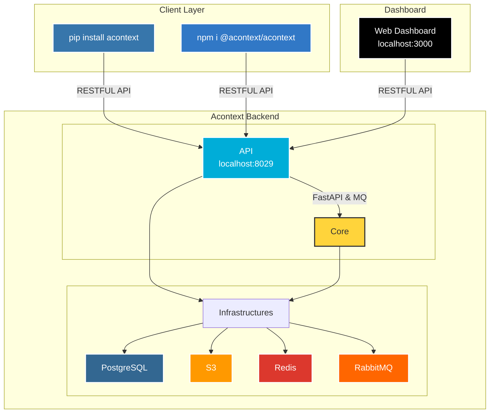
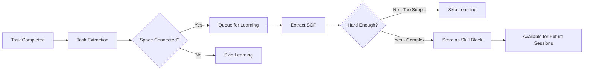

<div align="center">
  <a href="https://discord.acontext.io">
      
  </a>
  <p>
    <h4>Context Data Platform for Building Cloud-native AI Agents</h4>
  </p>
  <p align="center">
    <a href="https://pypi.org/project/acontext/"></a>
    <a href="https://www.npmjs.com/package/@acontext/acontext"></a>
    <a href="https://github.com/memodb-io/acontext/actions/workflows/core-test.yaml"></a>
    <a href="https://github.com/memodb-io/acontext/actions/workflows/api-test.yaml"></a>
    <a href="https://github.com/memodb-io/acontext/actions/workflows/cli-test.yaml"></a>
  </p>
  <p align="center">
    <a href="https://x.com/acontext_io"></a>
    <a href="https://discord.acontext.io"></a>
  </p>
  <div align="center">
    <!-- Keep these links. Translations will automatically update with the README. -->
    <a href="../../readme/de/README.md">Deutsch</a> | 
    <a href="../../readme/es/README.md">Español</a> | 
    <a href="../../readme/fr/README.md">Français</a> | 
    <a href="../../readme/ja/README.md">日本語</a> | 
    <a href="../../readme/ko/README.md">한국어</a> | 
    <a href="../../readme/pt/README.md">Português</a> | 
    <a href="../../readme/ru/README.md">Русский</a> | 
    <a href="../../readme/zh/README.md">中文</a>
  </div>
  <br/>
</div>


*每个人都在告诉你如何使用他们的Agent。但如果你需要为10万用户构建一个Agent，你会从哪里开始？*

**📦 问题1：你99%的数据库都是LLM消息。** 

> 糟糕的架构设计使你最有价值的数据变得昂贵且缓慢。Acontext通过PG、Redis和S3处理上下文存储和检索。
>
> ChatGPT、Gemini、Anthropic、图片、音频、文件...我们都支持。

**⏰ 问题2：长时间运行的Agent是个噩梦。** 

> 你了解上下文工程，但你总是从头开始写。Acontext内置了上下文编辑方法和开箱即用的todo agent。
>
> 管理Agent状态？小菜一碟。

**👀 问题3：你无法看到你的Agent表现如何。** 

> 你的用户真的满意吗？Acontext跟踪每个会话的任务，并向你展示Agent的实际成功率。
>
> 不要只关注token成本，先改进Agent。

**🧠 问题4：你的Agent时好时坏。**

> 它能从成功中学习吗？Acontext的experience agent记住成功的运行，并将它们转化为可重用的工具使用SOP。
>
> 一致性就是一切。


为了一次解决这些问题，Acontext成为了**上下文数据平台**：

<div align="center">
    <picture>
      
    </picture>
  <p>存储、观察和学习的上下文数据平台</p>
</div>


# 💡 核心功能

- **Context Engineering**
  - [Session](https://docs.acontext.io/store/messages/multi-provider): 为任何LLM、任何模态提供统一的消息存储。
  - [Disk](https://docs.acontext.io/store/disk): 使用文件路径保存/下载artifacts。
  - [Context Editing](https://docs.acontext.io/store/editing) - 一个API管理你的上下文窗口。

<div align="center">
    <picture>
      
    </picture>
  <p>Acontext中的Context Engineering</p>
</div>

- **观察Agent任务和用户反馈**
  - [Task](https://docs.acontext.io/observe/agent_tasks): 近实时收集Agent的工作状态、进度和偏好。
- **Agent自我学习**
  - [Experience](https://docs.acontext.io/learn/advance/experience-agent): 让Agent为每个用户学习SOP。
- **在一个[仪表板](https://docs.acontext.io/observe/dashboard)中查看所有内容**

<div align="center">
    <picture>
      
    </picture>
  <p>Agent成功率和其他指标的仪表板</p>
</div>


# 🏗️ 架构

<details>
<summary>点击打开</summary>



## 它们如何协同工作

```txt
┌──────┐    ┌────────────┐    ┌──────────────┐    ┌───────────────┐
│ User │◄──►│ Your Agent │◄──►│   Session    │    │ Artifact Disk │
└──────┘    └─────▲──────┘    └──────┬───────┘    └───────────────┘
                  │                  │ # if enable
                  │         ┌────────▼────────┐
                  │         │ Observed Tasks  │
                  │         └────────┬────────┘
                  │                  │ # if enable
                  │         ┌────────▼────────┐
                  │         │   Learn Skills  │
                  │         └────────┬────────┘
                  └──────────────────┘
                      Search skills
```


## 数据结构

<details>
<summary>📖 任务结构</summary>

```json
{
  "task_description": "Star https://github.com/memodb-io/Acontext",
  "progresses": [
    "I have navigated to Acontext repo",
    "Tried to Star but a pop-up required me to login",
    ...
  ],
  "user_preferences": [
    "user wants to use outlook email to login"
  ]
}
```
</details>


<details>
<summary>📖 技能结构</summary>


```json
{
    "use_when": "star a repo on github.com",
    "preferences": "use user's outlook account",
    "tool_sops": [
        {"tool_name": "goto", "action": "goto github.com"},
        {"tool_name": "click", "action": "find login button if any. login first"},
        ...
    ]
}
```

</details>


<details>
<summary>📖 Space结构</summary>

```txt
/
└── github/ (folder)
    └── GTM (page)
        ├── find_trending_repos (sop)
        └── find_contributor_emails (sop)
    └── basic_ops (page)
        ├── create_repo (sop)
        └── delete_repo (sop)
    ...
```
</details>

</details>


# 🚀 连接到Acontext

1. 前往 [Acontext.io](https://acontext.io)，领取免费额度。
2. 通过一键式引导获取你的API Key：`sk-ac-xxx`

<div align="center">
    <picture>
      
    </picture>
</div>


<details>
<summary>💻 自托管Acontext</summary>

我们有一个 `acontext-cli` 来帮助你快速进行概念验证。首先在终端中下载它：

```bash
curl -fsSL https://install.acontext.io | sh
```

你应该安装 [docker](https://www.docker.com/get-started/) 并拥有 OpenAI API Key，以便在计算机上启动 Acontext 后端：

```bash
mkdir acontext_server && cd acontext_server
acontext docker up
```

> [!IMPORTANT]
>
> 确保你的LLM有[调用工具](https://platform.openai.com/docs/guides/function-calling)的能力。默认情况下，Acontext将使用 `gpt-4.1`。

`acontext docker up` 将为Acontext创建/使用 `.env` 和 `config.yaml`，并创建 `db` 文件夹来持久化数据。


完成后，你可以访问以下端点：

- Acontext API Base URL: http://localhost:8029/api/v1
- Acontext Dashboard: http://localhost:3000/

</details>


# 🧐 使用Acontext构建Agent

使用 `acontext` 下载端到端脚本：

**Python**

```bash
acontext create my-proj --template-path "python/openai-basic"
```

> Python的更多示例：
>
> - `python/openai-agent-basic`: openai agent sdk中的自学习Agent。
> - `python/agno-basic`: agno framework中的自学习Agent。
> - `python/openai-agent-artifacts`: 可以编辑和下载Artifacts的Agent。

**Typescript**

```bash
acontext create my-proj --template-path "typescript/openai-basic"
```

> Typescript的更多示例：
>
> - `typescript/vercel-ai-basic`: @vercel/ai-sdk中的自学习Agent


> [!NOTE]
>
> 查看我们的示例仓库获取更多模板：[Acontext-Examples](https://github.com/memodb-io/Acontext-Examples)。
>
> 我们正在开发更多全栈Agent应用！[告诉我们你想要什么！](https://discord.acontext.io)


## 分步快速入门

<details>
<summary>点击打开</summary>


我们维护 Python [](https://pypi.org/project/acontext/) 和 Typescript [](https://www.npmjs.com/package/@acontext/acontext) SDK。下面的代码片段使用Python。

## 安装SDK

```
pip install acontext # for Python
npm i @acontext/acontext # for Typescript
```


## 初始化客户端

```python
import os
from acontext import AcontextClient

client = AcontextClient(
    api_key=os.getenv("ACONTEXT_API_KEY"),
)

# 如果你使用自托管Acontext：
# client = AcontextClient(
#     base_url="http://localhost:8029/api/v1",
#     api_key="sk-ac-your-root-api-bearer-token",
# )
```

> [📖 异步客户端文档](https://docs.acontext.io/settings/core)


## 存储

Acontext可以管理Agent会话和Artifacts。

### 保存消息 [📖](https://docs.acontext.io/api-reference/session/store-message-to-session)

Acontext为消息数据提供持久化存储。当你调用 `session.store_message` 时，Acontext将持久化消息并开始监控此会话：

<details>
<summary>代码片段</summary>

```python
session = client.sessions.create()

messages = [
    {"role": "user", "content": "I need to write a landing page of iPhone 15 pro max"},
    {
        "role": "assistant",
        "content": "Sure, my plan is below:\n1. Search for the latest news about iPhone 15 pro max\n2. Init Next.js project for the landing page\n3. Deploy the landing page to the website",
    }
]

# Save messages
for msg in messages:
    client.sessions.store_message(session_id=session.id, blob=msg, format="openai")
```

> [📖](https://docs.acontext.io/store/messages/multi-modal) 我们还支持多模态消息存储和anthropic SDK。


</details>

### 加载消息 [📖](https://docs.acontext.io/api-reference/session/get-messages-from-session)

使用 `sessions.get_messages` 获取你的会话消息

<details>
<summary>代码片段</summary>

```python
r = client.sessions.get_messages(session.id)
new_msg = r.items

new_msg.append({"role": "user", "content": "How are you doing?"})
r = openai_client.chat.completions.create(model="gpt-4.1", messages=new_msg)
print(r.choices[0].message.content)
client.sessions.store_message(session_id=session.id, blob=r.choices[0].message)
```

</details>

<div align="center">
    <picture>
      
    </picture>
  <p>你可以在本地仪表板中查看会话</p>
</div>


### Artifacts [📖](https://docs.acontext.io/store/disk)

为你的Agent创建一个磁盘，使用文件路径存储和读取Artifacts：

<details>
<summary>代码片段</summary>

```python
from acontext import FileUpload

disk = client.disks.create()

file = FileUpload(
    filename="todo.md",
    content=b"# Sprint Plan\n\n## Goals\n- Complete user authentication\n- Fix critical bugs"
)
artifact = client.disks.artifacts.upsert(
    disk.id,
    file=file,
    file_path="/todo/"
)


print(client.disks.artifacts.list(
    disk.id,
    path="/todo/"
))

result = client.disks.artifacts.get(
    disk.id,
    file_path="/todo/",
    filename="todo.md",
    with_public_url=True,
    with_content=True
)
print(f"✓ File content: {result.content.raw}")
print(f"✓ Download URL: {result.public_url}")        
```
</details>


<div align="center">
    <picture>
      
    </picture>
  <p>你可以在本地仪表板中查看Artifacts</p>
</div>


## 观察 [📖](https://docs.acontext.io/observe)

对于每个会话，Acontext将**自动**启动一个后台Agent来跟踪任务进度和用户反馈。**它就像一个后台TODO Agent**。Acontext将使用它来观察你日常Agent的成功率。

你可以使用SDK检索Agent会话的当前状态，用于上下文工程，如减少和压缩。 

<details>
<summary>完整脚本</summary>

```python
from acontext import AcontextClient

# Initialize client
client = AcontextClient(
    base_url="http://localhost:8029/api/v1", api_key="sk-ac-your-root-api-bearer-token"
)

# Create a project and session
session = client.sessions.create()

# Conversation messages
messages = [
    {"role": "user", "content": "I need to write a landing page of iPhone 15 pro max"},
    {
        "role": "assistant",
        "content": "Sure, my plan is below:\n1. Search for the latest news about iPhone 15 pro max\n2. Init Next.js project for the landing page\n3. Deploy the landing page to the website",
    },
    {
        "role": "user",
        "content": "That sounds good. Let's first collect the message and report to me before any landing page coding.",
    },
    {
        "role": "assistant",
        "content": "Sure, I will first collect the message then report to you before any landing page coding.",
      	"tool_calls": [
            {
                "id": "call_001",
                "type": "function",
                "function": {
                    "name": "search_news",
                    "arguments": "{\"query\": \"iPhone news\"}"
                }
            }
        ]
    },
]

# Store messages in a loop
for msg in messages:
    client.sessions.store_message(session_id=session.id, blob=msg, format="openai")

# Wait for task extraction to complete
client.sessions.flush(session.id)

# Display extracted tasks
tasks_response = client.sessions.get_tasks(session.id)
print(tasks_response)
for task in tasks_response.items:
    print(f"\nTask #{task.order}:")
    print(f"  ID: {task.id}")
    print(f"  Title: {task.data.task_description}")
    print(f"  Status: {task.status}")

    # Show progress updates if available
    if task.data.progresses:
        print(f"  Progress updates: {len(task.data.progresses)}")
        for progress in task.data.progresses:
            print(f"    - {progress}")

    # Show user preferences if available
    if task.data.user_preferences:
        print("  User preferences:")
        for pref in task.data.user_preferences:
            print(f"    - {pref}")

```
> `flush` 是一个阻塞调用，它将等待任务提取完成。
> 你不需要在生产环境中调用它，Acontext有一个[缓冲机制](https://docs.acontext.io/observe/buffer)来确保任务提取在正确的时间完成。

</details>

示例任务返回：

```txt
Task #1:
  Title: Search for the latest news about iPhone 15 Pro Max and report findings to the user before any landing page coding.
  Status: success
  Progress updates: 2
    - I confirmed that the first step will be reporting before moving on to landing page development.
    - I have already collected all the iPhone 15 pro max info and reported to the user, waiting for approval for next step.
  User preferences:
    - user expects a report on latest news about iPhone 15 pro max before any coding work on the landing page.

Task #2:
  Title: Initialize a Next.js project for the iPhone 15 Pro Max landing page.
  Status: pending

Task #3:
  Title: Deploy the completed landing page to the website.
  Status: pending
```


你可以在仪表板中查看会话任务的状态：

<div align="center">
    <picture>
      
    </picture>
  <p>任务演示</p>
</div>


## 自我学习

Acontext可以收集大量会话，并学习如何为某些任务调用工具的技能（SOP）。

### 将技能学习到 `Space` [📖](https://docs.acontext.io/learn/skill-space)

<div align="center">
    <picture>
      
    </picture>
  <p>自我学习如何工作？</p>
</div>

`Space` 可以在类似Notion的系统中存储技能和记忆。你首先需要将会话连接到 `Space` 以启用学习过程：

```python
# Step 1: Create a Space for skill learning
space = client.spaces.create()
print(f"Created Space: {space.id}")

# Step 2: Create a session attached to the space
session = client.sessions.create(space_id=space.id)

# ... push the agent working context
```

学习在后台进行，不是实时的（延迟约10-30秒）。 

Acontext在后台将执行的操作：



最终，带有工具调用模式的SOP块将被保存到 `Space`。你可以在仪表板中查看每个 `Space`：

<div align="center">
    <picture>
      
    </picture>
  <p>Space演示</p>
</div>


### 从 `Space` 搜索技能 [📖](https://docs.acontext.io/learn/search-skills)

要从 `Space` 搜索技能并在下一个会话中使用它们：

```python
result = client.spaces.experience_search(
    space_id=space.id,
    query="I need to implement authentication",
  	mode="fast"
)
```

Acontext支持 `fast` 和 `agentic` 搜索模式。前者使用嵌入来匹配技能。后者使用Experience Agent探索整个 `Space`，并尝试涵盖所需的每个技能。

返回的是一个sop块列表，如下所示：

```json
{
    "use_when": "star a github repo",
    "preferences": "use personal account. star but not fork",
    "tool_sops": [
        {"tool_name": "goto", "action": "goto the user given github repo url"},
        {"tool_name": "click", "action": "find login button if any, and start to login first"},
        ...
    ]
}
```

</details>


# 🔍 文档

要更好地了解Acontext的功能，请查看 [我们的文档](https://docs.acontext.io/)


# ❤️ 保持更新

在Github上为Acontext加星标以支持并接收即时通知 


# 🤝 保持联系

加入社区以获得支持和讨论：

-   [在Acontext Discord上与构建者讨论](https://discord.acontext.io) 👻 
-  [在X上关注Acontext](https://x.com/acontext_io) 𝕏 


# 🌟 贡献

- 首先查看我们的 [roadmap.md](../../ROADMAP.md)。
- 阅读 [contributing.md](../../CONTRIBUTING.md)


# 📑 许可证

本项目目前根据 [Apache License 2.0](LICENSE) 许可。


# 🥇 徽章

 

```md
[](https://acontext.io)

[](https://acontext.io)
```
